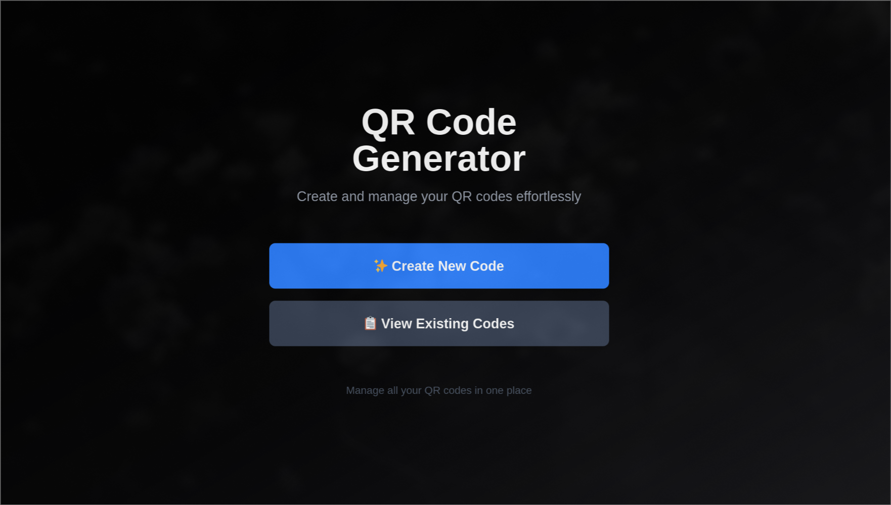
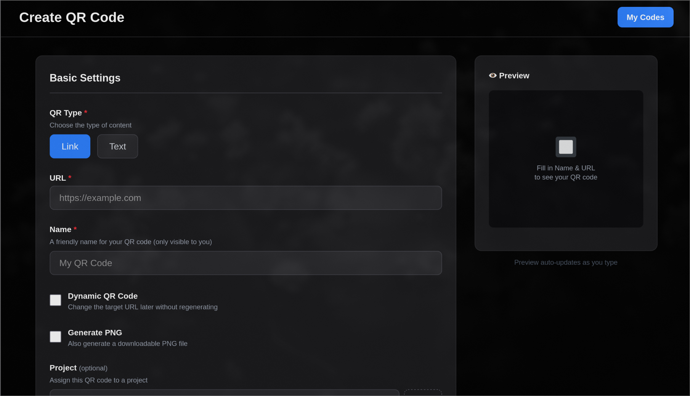
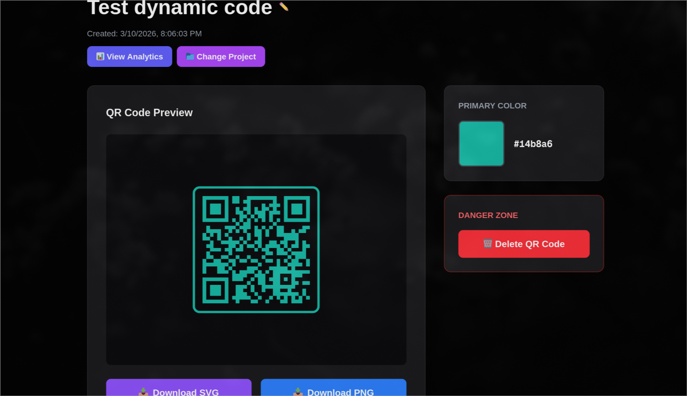
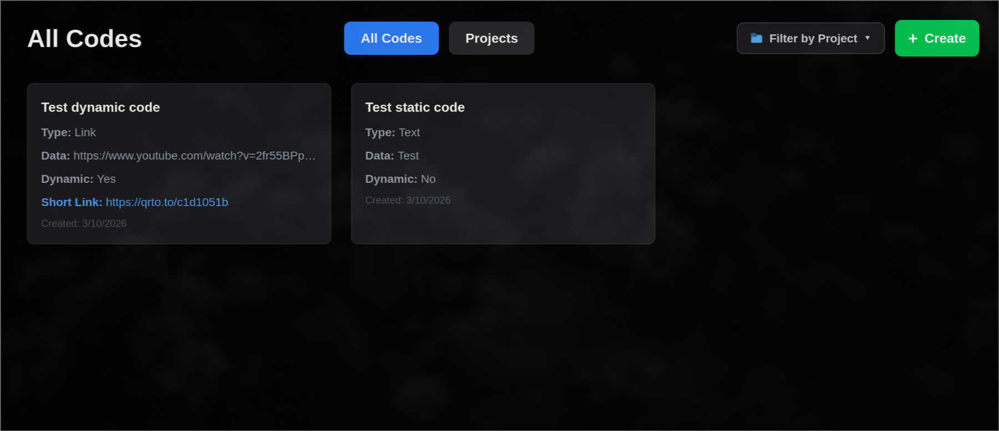
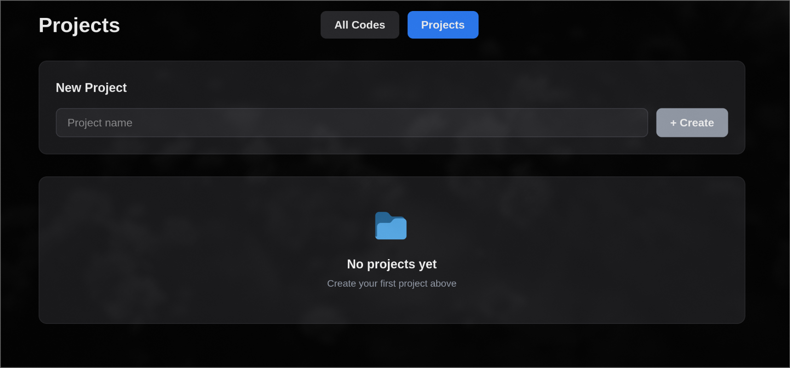
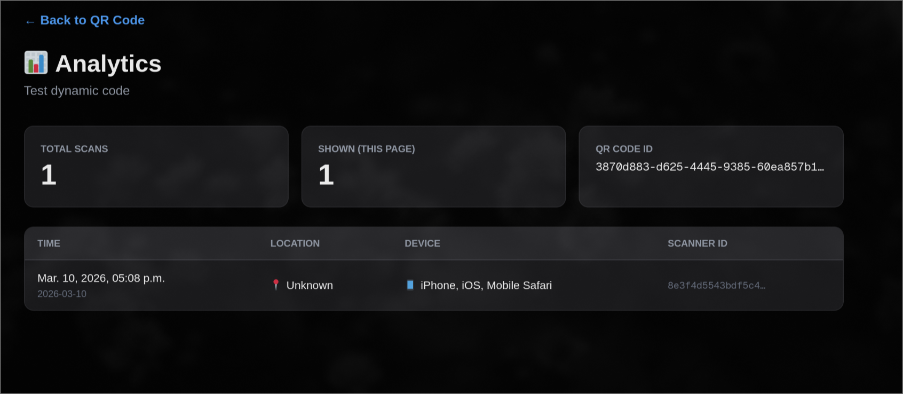

# Проектирование и анализ QR-кода генератора

## 1.1. Пользовательские сценарии

**Сценарий создания кода**
«Как пользователь, находясь на главном экране, я хочу нажать кнопку сгенерировать код, заполнить обязательные параметры (название, содержимое, тип кода) и получить готовый QR-код для дальнейшего использования».  

**Сценарий скачивания кода**
«Как пользователь, находясь на главном экране, я хочу перейти в раздел 'View Existing Codes', выбрать конкретный сгенерированный код и нажать кнопку 'Download PNG' или 'Download SVG', чтобы использовать его в своих материалах».  

**Сценарий добавления кода в проект**
«Как пользователь, находясь на главном экране, я хочу перейти в раздел 'View Existing Codes', выбрать нужный код, нажать кнопку 'Change Project', изменить привязку к проекту через выпадающий список и сохранить изменения для лучшей организации моих кодов».  

**Сценарий создания проекта**
«Как пользователь, находясь на главном экране, я хочу перейти в раздел 'View Existing Codes', открыть вкладку 'Projects', ввести название нового проекта в форму и нажать 'Create', чтобы группировать мои QR-коды по смысловым категориям».  

**Сценарий просмотра аналитики (дополнительно)**
«Как пользователь, находясь на странице конкретного динамического QR-кода, я хочу нажать кнопку 'View Analytics', чтобы перейти на экран детальной статистики и отслеживать количество и график сканирований моего кода для оценки его эффективности».  

## 1.2. Функциональные требования

**Обязательные функции:**
- Генерация QR-кода (статического или динамического) с использованием заданного содержимого (URL, текст и т.д.).
- Сохранение сгенерированных QR-кодов и их метаданных (название, тип).
- Просмотр списка ранее созданных QR-кодов (страница "View Existing Codes").
- Скачивание QR-кода в форматах PNG и SVG.
- Создание проектов для логической группировки QR-кодов.
- Привязка (и перепривязка) QR-кода к конкретному проекту.
- Удаление QR-кодов и проектов.
- Кастомизация внешнего вида QR-кода (цвет, логотип, форма паттернов).
- Просмотр аналитики по динамическим QR-кодам (количество сканирований).

**Опциональные функции:**
- Фильтрация списка QR-кодов по проектам.

## 1.3. Проектирование API

В приложении Next.js 15 (с использованием Server Actions и Route Handlers) реализованы следующие endpoint'ы:

| Метод | Путь | Описание / Параметры | Формат ответа |
| ----- | ---- | --------------------- | ------------- |
| `POST` | `/api/codes/project` | Обновление проекта для QR-кода. Body: `{ hovercodeId, projectId }` | `200 OK`, JSON обновленного кода |
| `GET` | `/api/codes/project/[project_id]` | Получить список `hovercodeId` кодов, привязанных к конкретному проекту. | `200 OK`, `string[]` |
| `DELETE` | `/api/delete-qr/[id]` | Удалить QR-код по его Hovercode ID. | `200 OK` |
| `GET` | `/api/download` | Проксирование скачивания картинок. Query: `url` (ссылка на картинку). | `200 OK`, Binary image stream |
| `GET` | `/api/projects` | Получить список всех проектов из БД. | `200 OK`, `ProjectModel[]` |
| `POST` | `/api/projects` | Создать новый проект. Body: `{ name }` | `201 Created`, JSON нового проекта |
| `DELETE` | `/api/projects/[id]` | Удаление проекта. | `200 OK` |
| `Server Action` | `createCodeAction` | Создание QR в Hovercode API и запись в БД. Payload: `HovercodeCreateCode` + `projectId`. | JSON созданного кода |

*Авторизация:* Доступ к API защищен серверной валидацией, взаимодействие с 3rd-party Hovercode API осуществляется с использованием закрытого `HOVERCODE_API_KEY` и `HOVERCODE_WORKSPACE_ID`. Со стороны пользователя авторизация пока не требуется (single-tenant режим).

## 1.4. Модель данных

Данные хранятся в реляционной базе данных PostgreSQL с использованием Prisma ORM.

**Сущность `Project`**
- `id` (String / UUID, Primary Key) - Уникальный идентификатор проекта.
- `name` (String) - Имя проекта.
- `createdAt` (DateTime) - Дата создания.
- `updatedAt` (DateTime) - Дата последнего обновления.

**Сущность `Code`**
- `id` (String / UUID, Primary Key) - Уникальный идентификатор записи в локальной БД.
- `name` (String) - Человекочитаемое название кода.
- `hovercodeId` (String, Unique) - Идентификатор кода во внешнем API Hovercode (используется для синхронизации).
- `projectId` (String, Optional) - Внешний ключ для связи с `Project`.
- `createdAt` (DateTime) - Дата создания.
- `updatedAt` (DateTime) - Дата последнего обновления.

*Отношение:* Один проект (`Project`) может содержать множество кодов (`Code` - One-to-Many).

## 1.5. Ключевые технические решения

- **Фронтенд и Бэкенд:** Next.js 15 (App Router). Выбран за отличную поддержку React 19, Server Components, Server Actions и быструю сборку через Turbopack. Это позволяет иметь монорепозиторий для клиентской и серверной части.
- **Внешнее API:** [Hovercode API (v2)](https://hovercode.com/api/v2). Используется для непосредственной генерации QR-кодов и сбора аналитики, чтобы не разрабатывать собственный сложный движок рендеринга и трекинга сканирований.
- **База данных:** PostgreSQL. Надежная реляционная СУБД, позволяющая хранить связи между Проектами и Кодами (интегрированными с Hovercode).
- **ORM:** Prisma v7. Выбрана за строгую типизацию схем (TypeScript), удобство написания миграций (`schema.prisma`) и интеграцию с Next.js Server Actions.
- **Стилизация:** Tailwind CSS v4. Позволяет быстро прототипировать адаптивный интерфейс без написания внешних CSS-файлов.
- **Деплоймент:** Docker & Docker Compose. Приложение собирается в "standalone" контейнер в один этап (Single-stage), что гарантирует переносимость окружения (включая зависимости Prisma) на любой сервер вместе с контейнерами базы данных.